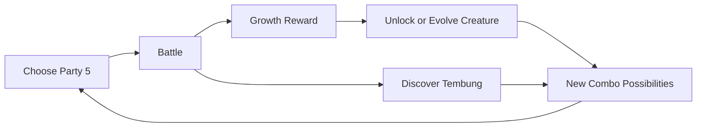

# Core Loop

## Short loop

1. Pilih 5 creature dari koleksi.
2. Masuk battle.
3. Setiap turn, rangkai 2-4 creature menjadi satu aksi.
4. Menang.
5. Dapat growth dan/atau progress collection.
6. Creature baru atau evolution lama membuka cara merangkai combo baru.
7. Battle lagi.

## Why collection matters

Creature baru bukan cuma statistik baru.

Creature baru = **command baru**.

Jika sebelumnya party memiliki HA, NA, CA, RA, KA lalu player mendapatkan DA, maka muncul kemungkinan baru:

- HA + DA
- NA + DA
- DA + CA
- DA + RA + HA
- dan seterusnya.

## Why evolution matters

Evolution memperdalam command yang sudah dipahami player, bukan mengganti seluruh aturan.

- Evo I: identitas dasar.
- Evo II: identitas lebih kuat.
- Evo III: mastery trait yang memengaruhi posisi/urutan combo.
