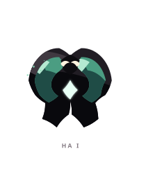
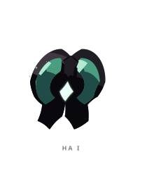
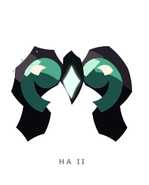
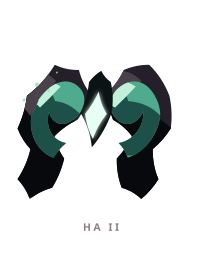
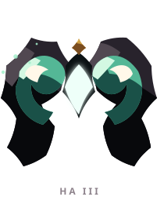
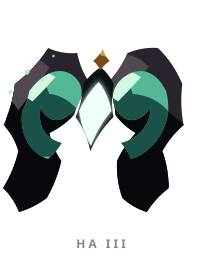

# HA ꦲ

> [!note]
> Visual Evo I-III sudah ada di project, tetapi gameplay identity belum ditetapkan di vault ini.

## Visual assets

| Form | Front | Back |
|---|---|---|
| Evo I |  |  |
| Evo II |  |  |
| Evo III |  |  |

Asset index: [[02-Creatures/Creature Visuals]]

## Identity

- Aksara: **HA**
- Script: **ꦲ**
- Bunyi dasar: **/ha/**
- Interpretation: Napas, awal, kehidupan.
- Personality: Tenang, hangat, protektif.
- Visual motifs: Lengkung kembar seperti tanduk atau gerbang, warna jade dan hitam, kristal putih di pusat, serta siluet yang sangat simetris.

## Evolution I

### Visual

Benih penjaga dengan dua lengkung yang masih tertutup di sekitar inti cahaya.

### Core

TBD

### Link

TBD

## Evolution II

### Visual change

Lengkungnya terbuka menjadi dua sisi pelindung; inti mulai terlihat sebagai pusat yang harus dijaga.

### Gameplay growth

TBD

## Evolution III

### Visual change

Menjadi gerbang hidup dengan struktur lebih tinggi dan inti yang jauh lebih terang, seolah mampu menahan tekanan dari dua arah.

### Mastery Trait

TBD

## Battle notes

- As opener: TBD
- As Link: TBD
- Natural counters: TBD
- Natural weaknesses/tradeoffs: TBD

## Combo notes

TBD after Core/Link identity is defined.

## Tembung connections

TBD after linguistic curation.

## Related

- [[Creature System]]
- [[Aksara Roster]]
- [[Combo System]]
