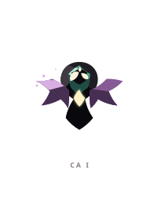
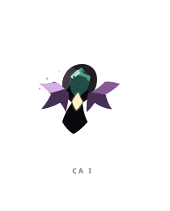
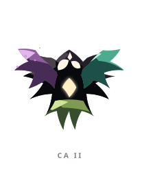
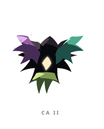
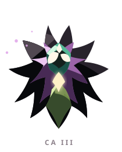
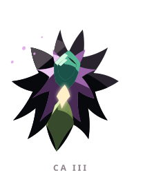

# CA ꦕ

> [!note]
> Visual Evo I-III sudah ada di project, tetapi gameplay identity belum ditetapkan di vault ini.

## Visual assets

| Form | Front | Back |
|---|---|---|
| Evo I |  |  |
| Evo II |  |  |
| Evo III |  |  |

Asset index: [[02-Creatures/Creature Visuals]]

## Identity

- Aksara: **CA**
- Script: **ꦕ**
- Bunyi dasar: **/ca/**
- Interpretation: Penciptaan, pertumbuhan.
- Personality: Kreatif, ingin tahu, optimistis.
- Visual motifs: Sayap ungu, aksen hijau, kristal putih, ujung-ujung radial seperti bulu atau duri, dan partikel kecil yang meninggalkan jejak.

## Evolution I

### Visual

Benih mungil bersayap yang baru belajar mengarahkan energinya ke satu pusat cahaya.

### Core

TBD

### Link

TBD

## Evolution II

### Visual change

Sayap bertambah dan tubuh melebar menjadi bentuk seperti bunga terbang; geraknya mulai terasa eksplosif.

### Gameplay growth

TBD

## Evolution III

### Visual change

Menjadi bintang berduri dengan banyak arah gerak, seolah satu percikan telah berubah menjadi ledakan kemungkinan.

### Mastery Trait

TBD

## Battle notes

- As opener: TBD
- As Link: TBD
- Natural counters: TBD
- Natural weaknesses/tradeoffs: TBD

## Combo notes

TBD after Core/Link identity is defined.

## Tembung connections

TBD after linguistic curation.

## Related

- [[Creature System]]
- [[Aksara Roster]]
- [[Combo System]]
