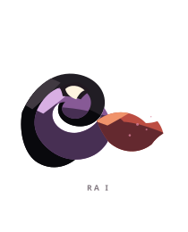
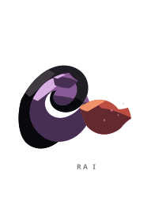
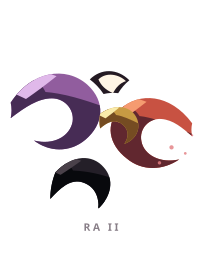
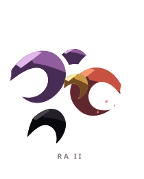
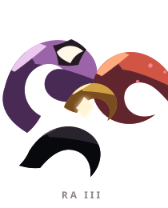
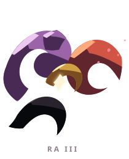

# RA ꦫ

> [!note]
> Visual Evo I-III sudah ada di project, tetapi gameplay identity belum ditetapkan di vault ini.

## Visual assets

| Form | Front | Back |
|---|---|---|
| Evo I |  |  |
| Evo II |  |  |
| Evo III |  |  |

Asset index: [[02-Creatures/Creature Visuals]]

## Identity

- Aksara: **RA**
- Script: **ꦫ**
- Bunyi dasar: **/ra/**
- Interpretation: Rasa, emosi.
- Personality: Empatik, ekspresif, perasa.
- Visual motifs: Lengkung seperti bulan sabit, aliran ungu-merah, aksen emas di pusat, serta ekor hitam yang memberi kesan momentum.

## Evolution I

### Visual

Satu arus melingkar dengan ekor yang mengarah ke depan, seperti gerakan pertama sebuah tarian.

### Core

TBD

### Link

TBD

## Evolution II

### Visual change

Arusnya terpecah menjadi dua lengkung yang saling mengejar; gerak dan arah menjadi bagian utama siluetnya.

### Gameplay growth

TBD

## Evolution III

### Visual change

Beberapa lengkung membentuk orbit yang lebih lengkap, memperlihatkan RA sebagai siklus, bukan sekadar garis lurus.

### Mastery Trait

TBD

## Battle notes

- As opener: TBD
- As Link: TBD
- Natural counters: TBD
- Natural weaknesses/tradeoffs: TBD

## Combo notes

TBD after Core/Link identity is defined.

## Tembung connections

TBD after linguistic curation.

## Related

- [[Creature System]]
- [[Aksara Roster]]
- [[Combo System]]
