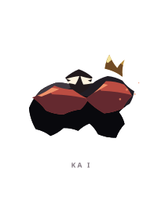
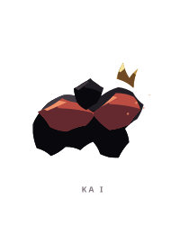
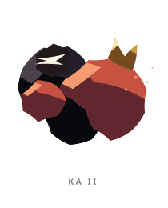
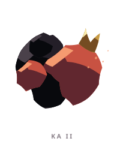
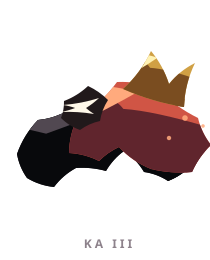
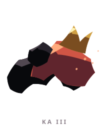

# KA ꦏ

> [!note]
> Visual Evo I-III sudah ada di project, tetapi gameplay identity belum ditetapkan di vault ini.

## Visual assets

| Form | Front | Back |
|---|---|---|
| Evo I |  |  |
| Evo II |  |  |
| Evo III |  |  |

Asset index: [[02-Creatures/Creature Visuals]]

## Identity

- Aksara: **KA**
- Script: **ꦏ**
- Bunyi dasar: **/ka/**
- Interpretation: Kehendak, tindakan.
- Personality: Tegas, berani, berkemauan kuat.
- Visual motifs: Tubuh rendah dan padat, pelat merah marun, bagian bawah hitam, moncong yang mengarah ke depan, serta mahkota emas kecil.

## Evolution I

### Visual

Benih berbentuk makhluk kecil berlapis yang sudah menunjukkan dorongan untuk menerobos.

### Core

TBD

### Link

TBD

## Evolution II

### Visual change

Punggung membesar dan mahkota menjadi lebih jelas; tubuhnya mulai menyerupai pendobrak berzirah.

### Gameplay growth

TBD

## Evolution III

### Visual change

Menjadi binatang pendobrak yang benar-benar siap menyerbu, dengan massa tubuh dan arah gerak yang sangat tegas.

### Mastery Trait

TBD

## Battle notes

- As opener: TBD
- As Link: TBD
- Natural counters: TBD
- Natural weaknesses/tradeoffs: TBD

## Combo notes

TBD after Core/Link identity is defined.

## Tembung connections

TBD after linguistic curation.

## Related

- [[Creature System]]
- [[Aksara Roster]]
- [[Combo System]]
