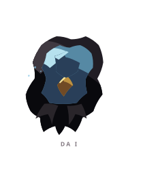
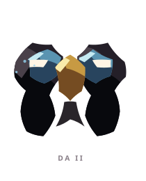
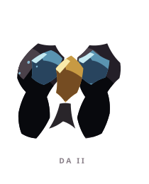
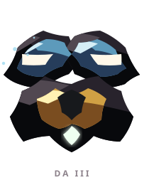
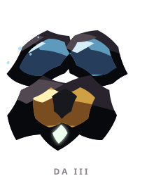

# DA ꦢ

> [!note]
> Visual Evo I-III sudah ada di project, tetapi gameplay identity belum ditetapkan di vault ini.

## Visual assets

| Form | Front | Back |
|---|---|---|
| Evo I |  |  |
| Evo II |  |  |
| Evo III |  |  |

Asset index: [[02-Creatures/Creature Visuals]]

## Identity

- Aksara: **DA**
- Script: **ꦢ**
- Bunyi dasar: **/da/**
- Interpretation: Keteguhan, fondasi.
- Personality: Kokoh, sabar, dapat diandalkan.
- Visual motifs: Wajah bertopeng, alis biru seperti pelindung, paruh atau inti emas, siluet gelap yang berat, dan simetri seperti lambang pengadilan.

## Evolution I

### Visual

Benih bertopeng dengan tubuh bulat dan tatapan tertutup, seperti hakim yang belum menjatuhkan keputusan.

### Core

TBD

### Link

TBD

## Evolution II

### Visual change

Topeng terbuka menjadi dua sisi yang mengapit inti emas; DA mulai tampak seperti pengamat dari dua sudut pandang.

### Gameplay growth

TBD

## Evolution III

### Visual change

Strukturnya menjadi sentinel berlapis dengan beberapa bidang pengamatan, menegaskan peran sebagai penimbang medan.

### Mastery Trait

TBD

## Battle notes

- As opener: TBD
- As Link: TBD
- Natural counters: TBD
- Natural weaknesses/tradeoffs: TBD

## Combo notes

TBD after Core/Link identity is defined.

## Tembung connections

TBD after linguistic curation.

## Related

- [[Creature System]]
- [[Aksara Roster]]
- [[Combo System]]
