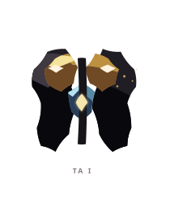
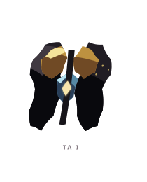
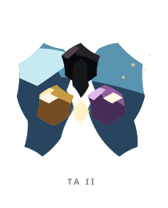
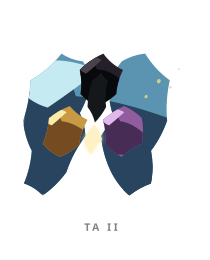
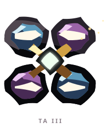
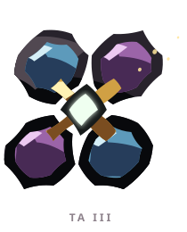

# TA ꦠ

> [!note]
> Visual Evo I-III sudah ada di project, tetapi gameplay identity belum ditetapkan di vault ini.

## Visual assets

| Form | Front | Back |
|---|---|---|
| Evo I |  |  |
| Evo II |  |  |
| Evo III |  |  |

Asset index: [[02-Creatures/Creature Visuals]]

## Identity

- Aksara: **TA**
- Script: **ꦠ**
- Bunyi dasar: **/ta/**
- Interpretation: Tatanan, struktur.
- Personality: Disiplin, teliti, teratur.
- Visual motifs: Garis vertikal dan silang, pasangan bidang biru-ungu, kristal putih di tengah, serta empat arah yang makin terbuka tiap evolusi.

## Evolution I

### Visual

Benih berupa dua sisi yang dipisahkan garis pusat, seperti gerbang yang belum dipilih arahnya.

### Core

TBD

### Link

TBD

## Evolution II

### Visual change

Gerbang membuka menjadi dua sayap dengan dua warna dan dua titik perhatian yang berbeda.

### Gameplay growth

TBD

## Evolution III

### Visual change

Empat sisi mengitari inti menjadi kompas hidup; TA tidak lagi hanya memilih antara dua arah.

### Mastery Trait

TBD

## Battle notes

- As opener: TBD
- As Link: TBD
- Natural counters: TBD
- Natural weaknesses/tradeoffs: TBD

## Combo notes

TBD after Core/Link identity is defined.

## Tembung connections

TBD after linguistic curation.

## Related

- [[Creature System]]
- [[Aksara Roster]]
- [[Combo System]]
