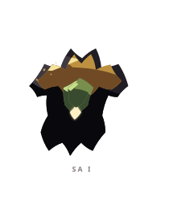
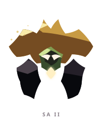
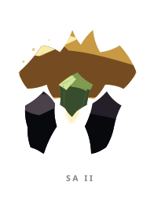
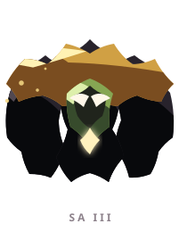
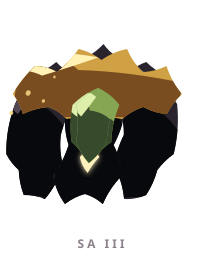

# SA ꦱ

> [!note]
> Visual Evo I-III sudah ada di project, tetapi gameplay identity belum ditetapkan di vault ini.

## Visual assets

| Form | Front | Back |
|---|---|---|
| Evo I |  |  |
| Evo II |  |  |
| Evo III |  |  |

Asset index: [[02-Creatures/Creature Visuals]]

## Identity

- Aksara: **SA**
- Script: **ꦱ**
- Bunyi dasar: **/sa/**
- Interpretation: Penjaga, perlindungan.
- Personality: Waspada, penyayang, setia.
- Visual motifs: Kanopi oker lebar, wajah hijau seperti lumut, jubah hitam berat, ujung menyerupai akar, dan bentuk yang makin masif.

## Evolution I

### Visual

Benih bertudung dengan kanopi kecil di atas wajah hijau, seperti penjaga di bawah pohon pertama.

### Core

TBD

### Link

TBD

## Evolution II

### Visual change

Kanopi melebar dan tubuh menjadi lebih kokoh; ia mulai terlihat seperti tempat berteduh yang bisa berjalan.

### Gameplay growth

TBD

## Evolution III

### Visual change

SA tumbuh menjadi elder hutan atau benteng hidup dengan tudung besar dan akar yang menancap ke bawah.

### Mastery Trait

TBD

## Battle notes

- As opener: TBD
- As Link: TBD
- Natural counters: TBD
- Natural weaknesses/tradeoffs: TBD

## Combo notes

TBD after Core/Link identity is defined.

## Tembung connections

TBD after linguistic curation.

## Related

- [[Creature System]]
- [[Aksara Roster]]
- [[Combo System]]
