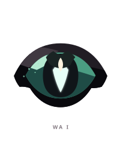
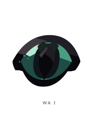
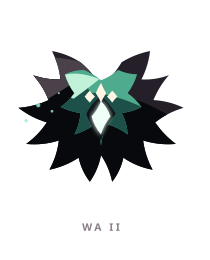
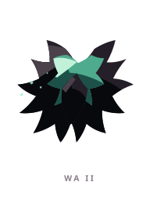
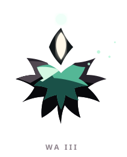
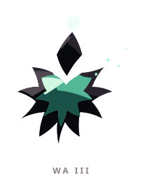

# WA ꦮ

> [!note]
> Visual Evo I-III sudah ada di project, tetapi gameplay identity belum ditetapkan di vault ini.

## Visual assets

| Form | Front | Back |
|---|---|---|
| Evo I |  |  |
| Evo II |  |  |
| Evo III |  |  |

Asset index: [[02-Creatures/Creature Visuals]]

## Identity

- Aksara: **WA**
- Script: **ꦮ**
- Bunyi dasar: **/wa/**
- Interpretation: Kesadaran, persepsi.
- Personality: Observan, intuitif, bijaksana.
- Visual motifs: Mata oval teal, pusat putih seperti berlian, kelopak hitam, partikel ringan, dan ruang kosong yang makin besar.

## Evolution I

### Visual

Benih berupa satu mata yang tenang, lebih banyak mengamati daripada bertindak.

### Core

TBD

### Link

TBD

## Evolution II

### Visual change

Mata membuka menjadi bunga berduri dengan banyak kelopak, membuat pengamatannya terasa lebih luas.

### Gameplay growth

TBD

## Evolution III

### Visual change

Tubuh menghilang menjadi bunga-roh dengan inti melayang di atasnya; WA tampak hadir tanpa harus memiliki massa.

### Mastery Trait

TBD

## Battle notes

- As opener: TBD
- As Link: TBD
- Natural counters: TBD
- Natural weaknesses/tradeoffs: TBD

## Combo notes

TBD after Core/Link identity is defined.

## Tembung connections

TBD after linguistic curation.

## Related

- [[Creature System]]
- [[Aksara Roster]]
- [[Combo System]]
