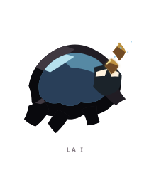
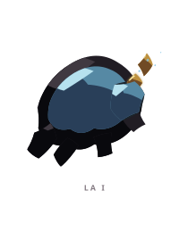
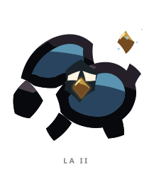
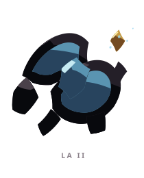
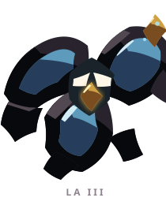
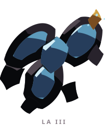

# LA ꦭ

> [!note]
> Visual Evo I-III sudah ada di project, tetapi gameplay identity belum ditetapkan di vault ini.

## Visual assets

| Form | Front | Back |
|---|---|---|
| Evo I |  |  |
| Evo II |  |  |
| Evo III |  |  |

Asset index: [[02-Creatures/Creature Visuals]]

## Identity

- Aksara: **LA**
- Script: **ꦭ**
- Bunyi dasar: **/la/**
- Interpretation: Laku, tuntunan sejati.
- Personality: Tekun, rendah hati, terarah.
- Visual motifs: Cangkang biru membulat, kaki gelap yang kokoh, lapisan zirah, inti atau mahkota emas, dan siluet seperti kendaraan kecil.

## Evolution I

### Visual

Benih berzirah dengan cangkang besar yang sudah berfungsi sebagai rumah sekaligus perlindungan.

### Core

TBD

### Link

TBD

## Evolution II

### Visual change

Cangkang terpecah menjadi dua massa seperti roda atau mesin, membuat LA tampak lebih siap membawa beban.

### Gameplay growth

TBD

## Evolution III

### Visual change

Lapisan pelindung bertambah dan inti emas menjadi pusat komando; LA berkembang menjadi benteng kecil yang bergerak.

### Mastery Trait

TBD

## Battle notes

- As opener: TBD
- As Link: TBD
- Natural counters: TBD
- Natural weaknesses/tradeoffs: TBD

## Combo notes

TBD after Core/Link identity is defined.

## Tembung connections

TBD after linguistic curation.

## Related

- [[Creature System]]
- [[Aksara Roster]]
- [[Combo System]]
