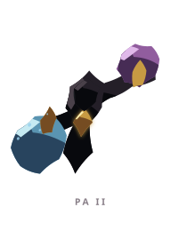

# PA ꦥ

> [!note]
> Visual Evo I-III sudah ada di project, tetapi gameplay identity belum ditetapkan di vault ini.

## Visual assets

| Form | Front | Back |
|---|---|---|
| Evo I |  |  |
| Evo II |  |  |
| Evo III |  |  |

Asset index: [[02-Creatures/Creature Visuals]]

## Identity

- Aksara: **PA**
- Script: **ꦥ**
- Bunyi dasar: **/pa/**
- Interpretation: Keseimbangan.
- Personality: Adil, stabil, diplomatis.
- Visual motifs: Tubuh tengah yang ramping, dua wadah biru-ungu, pegangan emas, garis penghubung, dan bentuk seperti pengangkut ritual.

## Evolution I

### Visual

Benih kecil yang memegang dua wadah berbeda di kiri dan kanan, belum sepenuhnya mampu mengangkat bebannya.

### Core

TBD

### Link

TBD

## Evolution II

### Visual change

Kedua wadah mulai menjauh dari tubuh dan terhubung melalui lengan panjang; PA belajar mengelola jarak.

### Gameplay growth

TBD

## Evolution III

### Visual change

PA menjadi pembawa seremonial dengan dua wadah yang stabil mengitari inti pusat.

### Mastery Trait

TBD

## Battle notes

- As opener: TBD
- As Link: TBD
- Natural counters: TBD
- Natural weaknesses/tradeoffs: TBD

## Combo notes

TBD after Core/Link identity is defined.

## Tembung connections

TBD after linguistic curation.

## Related

- [[Creature System]]
- [[Aksara Roster]]
- [[Combo System]]
