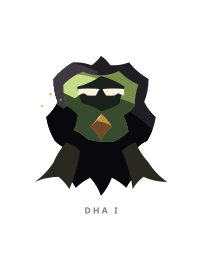
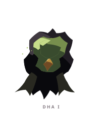
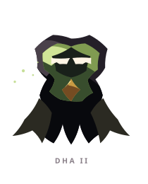
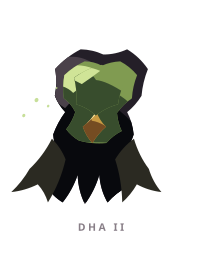
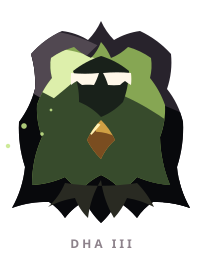
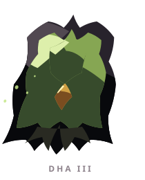

# DHA ꦣ

> [!note]
> Visual Evo I-III sudah ada di project, tetapi gameplay identity belum ditetapkan di vault ini.

## Visual assets

| Form | Front | Back |
|---|---|---|
| Evo I |  |  |
| Evo II |  |  |
| Evo III |  |  |

Asset index: [[02-Creatures/Creature Visuals]]

## Identity

- Aksara: **DHA**
- Script: **ꦣ**
- Bunyi dasar: **/dha/**
- Interpretation: Ketetapan, ketabahan.
- Personality: Teguh, tabah, tahan uji.
- Visual motifs: Tudung hijau, mantel hitam lebar, inti emas, ujung seperti akar atau bulu, dan volume tubuh yang terus membesar.

## Evolution I

### Visual

Benih bertudung dengan wajah hijau dan ujung mantel yang tajam seperti sumpah yang belum selesai diucapkan.

### Core

TBD

### Link

TBD

## Evolution II

### Visual change

Mantel melebar dan ujungnya memanjang; DHA mulai tampak seperti penjaga yang bisa menaungi creature lain.

### Gameplay growth

TBD

## Evolution III

### Visual change

Menjadi sosok besar seperti benteng lumut atau roh penjaga tua, dengan tubuh yang menutup hampir seluruh inti.

### Mastery Trait

TBD

## Battle notes

- As opener: TBD
- As Link: TBD
- Natural counters: TBD
- Natural weaknesses/tradeoffs: TBD

## Combo notes

TBD after Core/Link identity is defined.

## Tembung connections

TBD after linguistic curation.

## Related

- [[Creature System]]
- [[Aksara Roster]]
- [[Combo System]]
