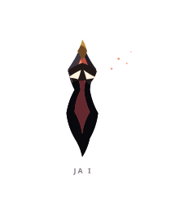
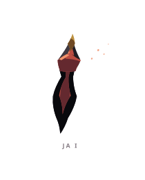
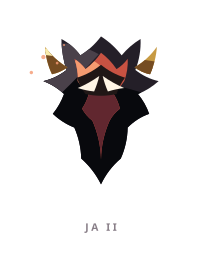
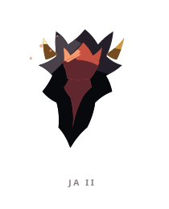
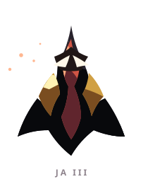
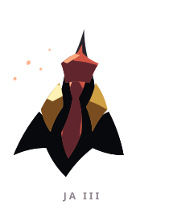

# JA ꦗ

> [!note]
> Visual Evo I-III sudah ada di project, tetapi gameplay identity belum ditetapkan di vault ini.

## Visual assets

| Form | Front | Back |
|---|---|---|
| Evo I |  |  |
| Evo II |  |  |
| Evo III |  |  |

Asset index: [[02-Creatures/Creature Visuals]]

## Identity

- Aksara: **JA**
- Script: **ꦗ**
- Bunyi dasar: **/ja/**
- Interpretation: Pendakian, kemenangan.
- Personality: Gigih, percaya diri, pantang menyerah.
- Visual motifs: Siluet vertikal yang ramping, inti merah seperti bilah, ujung emas, sirip hitam, dan aksen yang selalu mengarah ke atas atau bawah.

## Evolution I

### Visual

Benih tipis seperti jarum atau anak panah, menyimpan seluruh energinya di satu garis lurus.

### Core

TBD

### Link

TBD

## Evolution II

### Visual change

Jarum membuka menjadi sosok duelist dengan bahu dan mahkota tajam; presisi mulai punya bobot.

### Gameplay growth

TBD

## Evolution III

### Visual change

JA menjadi tombak atau panji hidup yang lebih lebar, tetapi tetap mempertahankan ujung tunggal yang sangat tegas.

### Mastery Trait

TBD

## Battle notes

- As opener: TBD
- As Link: TBD
- Natural counters: TBD
- Natural weaknesses/tradeoffs: TBD

## Combo notes

TBD after Core/Link identity is defined.

## Tembung connections

TBD after linguistic curation.

## Related

- [[Creature System]]
- [[Aksara Roster]]
- [[Combo System]]
