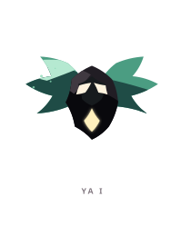
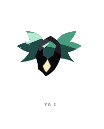
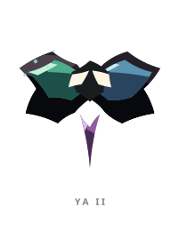
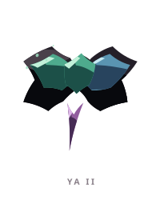
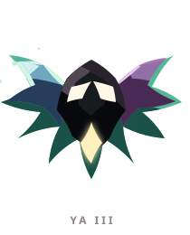
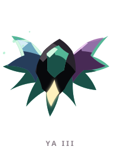

# YA ꦪ

> [!note]
> Visual Evo I-III sudah ada di project, tetapi gameplay identity belum ditetapkan di vault ini.

## Visual assets

| Form | Front | Back |
|---|---|---|
| Evo I |  |  |
| Evo II |  |  |
| Evo III |  |  |

Asset index: [[02-Creatures/Creature Visuals]]

## Identity

- Aksara: **YA**
- Script: **ꦪ**
- Bunyi dasar: **/ya/**
- Interpretation: Perluasan.
- Personality: Terbuka, bebas, adaptif.
- Visual motifs: Sayap berpasangan, warna mint-biru-ungu, kristal putih di pusat, ekor cahaya, dan gerak yang terasa seperti meluncur.

## Evolution I

### Visual

Benih bersayap dengan satu kristal pusat, seperti kurir kecil yang baru menerima pesan pertamanya.

### Core

TBD

### Link

TBD

## Evolution II

### Visual change

Sayap terbelah menjadi dua warna dan tubuh memanjang; YA mulai berfungsi sebagai jembatan antararah.

### Gameplay growth

TBD

## Evolution III

### Visual change

Empat sayap membentuk bunga atau jaringan hidup, menunjukkan bahwa YA mampu menghubungkan banyak titik sekaligus.

### Mastery Trait

TBD

## Battle notes

- As opener: TBD
- As Link: TBD
- Natural counters: TBD
- Natural weaknesses/tradeoffs: TBD

## Combo notes

TBD after Core/Link identity is defined.

## Tembung connections

TBD after linguistic curation.

## Related

- [[Creature System]]
- [[Aksara Roster]]
- [[Combo System]]
