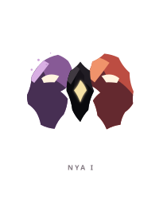
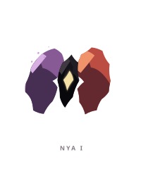
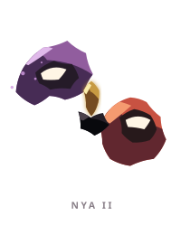
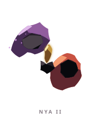
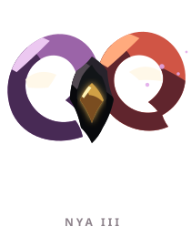
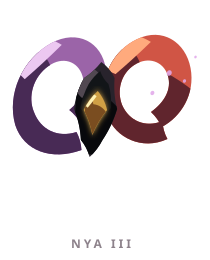

# NYA ꦚ

> [!note]
> Visual Evo I-III sudah ada di project, tetapi gameplay identity belum ditetapkan di vault ini.

## Visual assets

| Form | Front | Back |
|---|---|---|
| Evo I |  |  |
| Evo II |  |  |
| Evo III |  |  |

Asset index: [[02-Creatures/Creature Visuals]]

## Identity

- Aksara: **NYA**
- Script: **ꦚ**
- Bunyi dasar: **/nya/**
- Interpretation: Persatuan.
- Personality: Ramah, kooperatif, penyatu.
- Visual motifs: Dua sisi cermin ungu-koral, ruang kosong di tengah, engsel emas, mata berpasangan, dan bentuk yang selalu mencari simetri.

## Evolution I

### Visual

Benih berupa dua separuh yang masih bertemu di pusat, seperti dua suara yang belum menemukan ritme bersama.

### Core

TBD

### Link

TBD

## Evolution II

### Visual change

Kedua sisi terpisah dan saling berhadapan; hubungan mereka terlihat sebagai percakapan, bukan satu tubuh tunggal.

### Gameplay growth

TBD

## Evolution III

### Visual change

Lengkung ungu-koral membentuk gerhana di sekitar ruang kosong, menandakan persatuan yang tetap menyisakan perbedaan.

### Mastery Trait

TBD

## Battle notes

- As opener: TBD
- As Link: TBD
- Natural counters: TBD
- Natural weaknesses/tradeoffs: TBD

## Combo notes

TBD after Core/Link identity is defined.

## Tembung connections

TBD after linguistic curation.

## Related

- [[Creature System]]
- [[Aksara Roster]]
- [[Combo System]]
