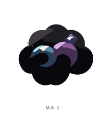
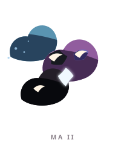
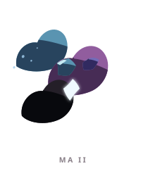
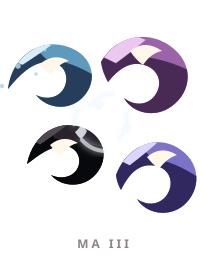
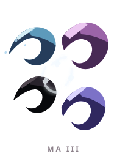

# MA ꦩ

> [!note]
> Visual Evo I-III sudah ada di project, tetapi gameplay identity belum ditetapkan di vault ini.

## Visual assets

| Form | Front | Back |
|---|---|---|
| Evo I |  |  |
| Evo II |  |  |
| Evo III |  |  |

Asset index: [[02-Creatures/Creature Visuals]]

## Identity

- Aksara: **MA**
- Script: **ꦩ**
- Bunyi dasar: **/ma/**
- Interpretation: Roh, jiwa.
- Personality: Hening, dalam, spiritual.
- Visual motifs: Awan hitam, bulan sabit biru-ungu, kilau putih, potongan yang mengorbit, dan komposisi yang tidak pernah benar-benar menyentuh tanah.

## Evolution I

### Visual

Benih seperti awan kecil dengan satu bentuk sabit yang muncul dari kegelapan.

### Core

TBD

### Link

TBD

## Evolution II

### Visual change

Awan pecah menjadi beberapa bentuk melayang yang tetap terhubung oleh cahaya di tengah.

### Gameplay growth

TBD

## Evolution III

### Visual change

Fragmen berubah menjadi konstelasi empat sabit, seolah mimpi MA kini cukup luas untuk memiliki orbitnya sendiri.

### Mastery Trait

TBD

## Battle notes

- As opener: TBD
- As Link: TBD
- Natural counters: TBD
- Natural weaknesses/tradeoffs: TBD

## Combo notes

TBD after Core/Link identity is defined.

## Tembung connections

TBD after linguistic curation.

## Related

- [[Creature System]]
- [[Aksara Roster]]
- [[Combo System]]
