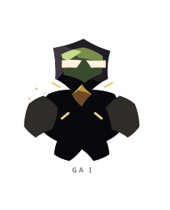
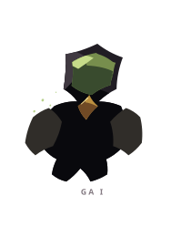
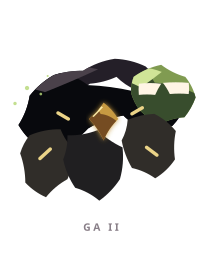
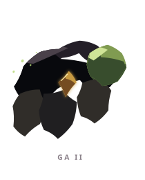
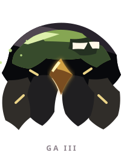
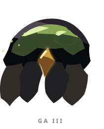

# GA ꦒ

> [!note]
> Visual Evo I-III sudah ada di project, tetapi gameplay identity belum ditetapkan di vault ini.

## Visual assets

| Form | Front | Back |
|---|---|---|
| Evo I |  |  |
| Evo II |  |  |
| Evo III |  |  |

Asset index: [[02-Creatures/Creature Visuals]]

## Identity

- Aksara: **GA**
- Script: **ꦒ**
- Bunyi dasar: **/ga/**
- Interpretation: Tubuh fisik.
- Personality: Praktis, kuat, membumi.
- Visual motifs: Bahu dan kepalan berzirah, visor hijau lumut, inti emas, bentuk blok yang kokoh, serta aksen garis seperti sambungan mekanis.

## Evolution I

### Visual

Benih berupa penjaga kecil dengan bahu lebar dan inti emas yang baru mulai dibentuk.

### Core

TBD

### Link

TBD

## Evolution II

### Visual change

Tubuh menjadi lebih membungkuk dan berlapis, seperti pekerja yang membawa rangka atau alat berat.

### Gameplay growth

TBD

## Evolution III

### Visual change

GA berkembang menjadi bulwark berlapis lumut dengan tubuh besar yang tampak mampu menahan benturan berulang.

### Mastery Trait

TBD

## Battle notes

- As opener: TBD
- As Link: TBD
- Natural counters: TBD
- Natural weaknesses/tradeoffs: TBD

## Combo notes

TBD after Core/Link identity is defined.

## Tembung connections

TBD after linguistic curation.

## Related

- [[Creature System]]
- [[Aksara Roster]]
- [[Combo System]]
