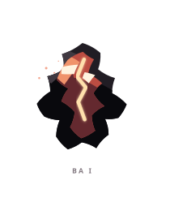
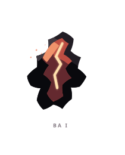
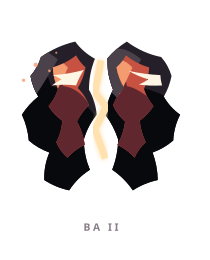
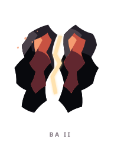
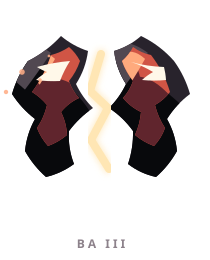
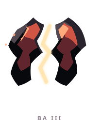

# BA ꦧ

> [!note]
> Visual Evo I-III sudah ada di project, tetapi gameplay identity belum ditetapkan di vault ini.

## Visual assets

| Form | Front | Back |
|---|---|---|
| Evo I |  |  |
| Evo II |  |  |
| Evo III |  |  |

Asset index: [[02-Creatures/Creature Visuals]]

## Identity

- Aksara: **BA**
- Script: **ꦧ**
- Bunyi dasar: **/ba/**
- Interpretation: Kefanaan, keretakan.
- Personality: Intens, rapuh, jujur.
- Visual motifs: Retakan putih-emas seperti petir, merah marun, pecahan hitam, simetri yang terbelah, dan cahaya kuat di celah tengah.

## Evolution I

### Visual

Benih ramping seperti percikan yang masih terkurung dalam satu tubuh gelap.

### Core

TBD

### Link

TBD

## Evolution II

### Visual change

Tubuh mulai membelah menjadi dua sisi dengan garis cahaya di antara keduanya; tekanan internal terlihat jelas.

### Gameplay growth

TBD

## Evolution III

### Visual change

Kedua sisi berdiri terpisah dan retakan menjadi jalur cahaya yang terkendali, bukan lagi sekadar luka.

### Mastery Trait

TBD

## Battle notes

- As opener: TBD
- As Link: TBD
- Natural counters: TBD
- Natural weaknesses/tradeoffs: TBD

## Combo notes

TBD after Core/Link identity is defined.

## Tembung connections

TBD after linguistic curation.

## Related

- [[Creature System]]
- [[Aksara Roster]]
- [[Combo System]]
