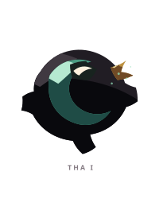
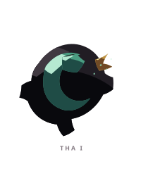
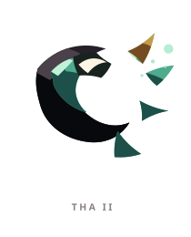
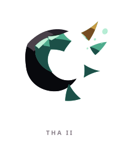
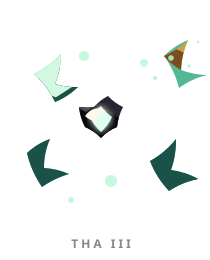
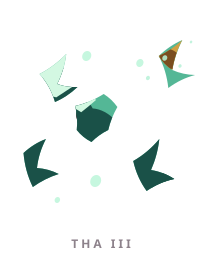

# THA ꦛ

> [!note]
> Visual Evo I-III sudah ada di project, tetapi gameplay identity belum ditetapkan di vault ini.

## Visual assets

| Form | Front | Back |
|---|---|---|
| Evo I |  |  |
| Evo II |  |  |
| Evo III |  |  |

Asset index: [[02-Creatures/Creature Visuals]]

## Identity

- Aksara: **THA**
- Script: **ꦛ**
- Bunyi dasar: **/tha/**
- Interpretation: Pelepasan, peluruhan.
- Personality: Ringan, lentur, mudah berubah.
- Visual motifs: Sabit teal, mahkota emas kecil, sirip yang terlepas, partikel mengambang, dan ruang kosong yang makin dominan.

## Evolution I

### Visual

Benih berbentuk makhluk sabit yang masih utuh, ringan dan bergerak seperti arus air.

### Core

TBD

### Link

TBD

## Evolution II

### Visual change

Tubuh mulai terurai menjadi sirip dan pecahan yang tetap mengarah ke satu pusat.

### Gameplay growth

TBD

## Evolution III

### Visual change

Hampir seluruh tubuh lenyap dan hanya menyisakan inti serta serpihan cahaya, seperti kehadiran yang baru saja melewati dunia.

### Mastery Trait

TBD

## Battle notes

- As opener: TBD
- As Link: TBD
- Natural counters: TBD
- Natural weaknesses/tradeoffs: TBD

## Combo notes

TBD after Core/Link identity is defined.

## Tembung connections

TBD after linguistic curation.

## Related

- [[Creature System]]
- [[Aksara Roster]]
- [[Combo System]]
