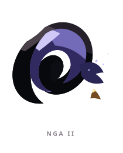

# NGA ꦔ

> [!note]
> Visual Evo I-III sudah ada di project, tetapi gameplay identity belum ditetapkan di vault ini.

## Visual assets

| Form | Front | Back |
|---|---|---|
| Evo I |  |  |
| Evo II |  |  |
| Evo III |  |  |

Asset index: [[02-Creatures/Creature Visuals]]

## Identity

- Aksara: **NGA**
- Script: **ꦔ**
- Bunyi dasar: **/nga/**
- Interpretation: Akhir, kembali, siklus.
- Personality: Tenang, bijak, menerima.
- Visual motifs: Spiral indigo-violet, lingkaran konsentris, aksen emas sebagai jangkar, mata putih, dan siluet seperti orbit atau portal.

## Evolution I

### Visual

Benih berupa spiral tertutup dengan inti yang masih tersembunyi di dalam kedalamannya.

### Core

TBD

### Link

TBD

## Evolution II

### Visual change

Spiral membuka arah dan membentuk semacam ekor atau kompas, seolah kedalaman mulai memiliki tujuan.

### Gameplay growth

TBD

## Evolution III

### Visual change

Beberapa cincin orbit terbentuk mengelilingi pusat gelap; NGA menjadi pintu menuju kedalaman, bukan sekadar pusaran.

### Mastery Trait

TBD

## Battle notes

- As opener: TBD
- As Link: TBD
- Natural counters: TBD
- Natural weaknesses/tradeoffs: TBD

## Combo notes

TBD after Core/Link identity is defined.

## Tembung connections

TBD after linguistic curation.

## Related

- [[Creature System]]
- [[Aksara Roster]]
- [[Combo System]]
