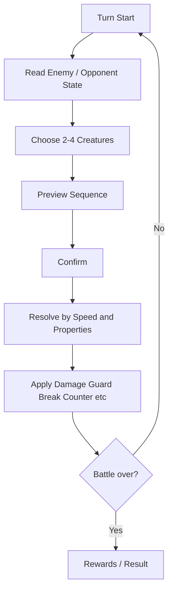

# Battle Overview

## Battle goal

Habiskan HP lawan sebelum HP player habis.

Untuk prototype awal, kandidat paling sederhana adalah **shared Party HP**. Ini belum locked.

## Turn flow



## Fundamental rule

**First creature determines the base action. Later creatures modify it.**

```text
HA + CA
= HA Core + CA Link

CA + HA
= CA Core + HA Link
```

Therefore order matters.

## Why this matters

The system can create many useful actions without manually authoring a unique skill for every possible sequence.
