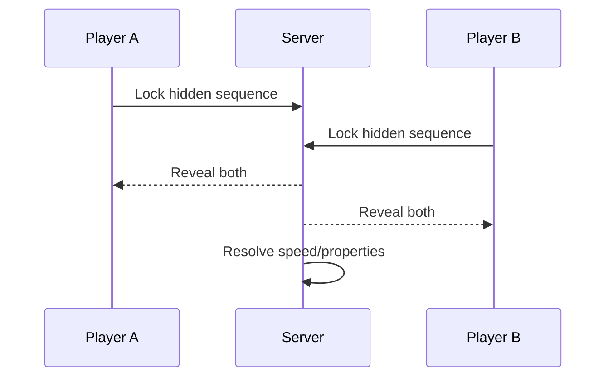

# PvP Rules

## Problem with PvE-style full intent

If Player A sees exactly what Player B chose before acting, PvP becomes:

```text
see action -> choose known counter
```

That removes prediction.

## Recommended direction: simultaneous turns



Both players choose without seeing the opponent's final sequence.

Then both are revealed and resolved together.

## Information that remains public

Recommended:

- opponent party of 5 is visible,
- opponent creature evolution is visible,
- current HP/status is visible.

Therefore player knows the opponent's **toolbox**, but not the exact action.

## Partial telegraph candidate

A promising option is to reveal only the first creature after it is committed:

```text
Opponent:
HA + ? + ?
```

This tells the player the likely base action, while Links remain unknown.

Example:

- HA + CA may be Break offense.
- HA + NA may add defense.
- HA + KA may threaten counter.

This creates mind games without making the result random.

> [!question]
> Whether first-slot partial telegraph is actually better than fully hidden selection must be playtested.
